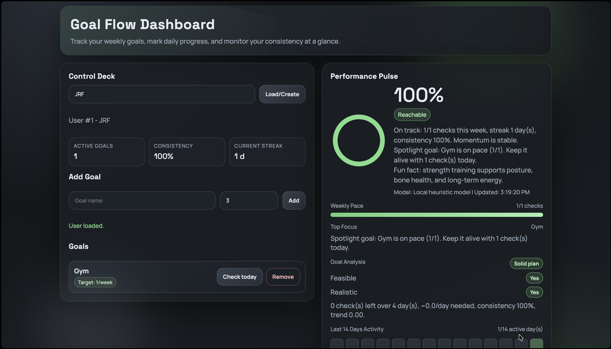

# Goal Flow Dashboard



Goal Flow Dashboard is a fullstack local app to track weekly goals, log daily progress, and evaluate execution quality with a local scoring engine.

## Features

- Create or reload a user by `username`
- Add multiple goals with a weekly target (`1..21`)
- Check goals daily (`Check today`)
- Remove goals (`Remove`) and cascade-delete related logs
- Compute weekly performance score (`0-100`) with statuses:
  - `Reachable`
  - `At risk`
  - `Early estimate`
- Score behavior:
  - `0` when no user is loaded in the UI
  - `0` when a user has no goals
  - `100` as soon as the weekly target is reached
- Goal analysis panel:
  - `Feasible`
  - `Realistic`
  - short actionable rationale
- 14-day activity heatmap
- Local admin reset (`Clear database`)

## Tech Stack

- Backend: FastAPI, SQLAlchemy 2.0, SQLite
- Frontend: HTML/CSS/JS (single template, no framework)
- Data/Scoring: pandas, numpy, scikit-learn
- Runtime: Python 3.11, Uvicorn

## Project Structure

```text
goal-tracker-ml/
├── app/
│   ├── __init__.py
│   ├── main.py
│   ├── db.py
│   ├── models.py
│   ├── schemas.py
│   ├── crud.py
│   └── ml.py
├── templates/
│   └── index.html
├── requirements.txt
├── goals.db
└── README.md
```

## Quick Start

### 1) Create environment

```bash
git clone https://github.com/JRF-cell/Goal-Progress-Tracker.git
cd Goal-Progress-Tracker
python3.11 -m venv .venv
source .venv/bin/activate
python -m pip install --upgrade pip
python -m pip install -r requirements.txt
```

### 2) Run app

```bash
python -m uvicorn app.main:app --reload
```

### 3) Open

- App: <http://127.0.0.1:8000/>
- API docs: <http://127.0.0.1:8000/docs>

## API Endpoints

### Users

- `POST /api/users`  
  Create or load user from `username`

### Goals

- `POST /api/goals`  
  Create goal (`user_id`, `name`, `target_per_week`)
- `GET /api/goals?user_id=<id>`  
  List user goals
- `DELETE /api/goals/{goal_id}`  
  Delete one goal and its check history
- `POST /api/goals/{goal_id}/check`  
  Upsert today's check (or custom date)
- `GET /api/goals/{goal_id}/history?days=30`  
  Get goal history

### Scoring

- `GET /api/users/{user_id}/ai-score`  
  Returns:
  - `score`
  - `reachable`
  - `comment`
  - `comment_source` (`local`)
  - `generated_at`
  - `engine`
  - `details`

### Local Admin

- `POST /api/admin/clear`  
  Clear all local data (`users`, `goals`, `goal_logs`)

## Score Logic (Local)

The score combines:

1. Heuristic assessment (always available)
2. Logistic Regression when enough historical data exists
3. Safe fallback modes for sparse or unstable datasets

Main signals:

- last 7-day completion progress
- weekly target pressure
- consistency over recent days
- streak
- short-term trend
- required daily pace for remaining days

Explicit rules:

- If no goal exists, score is `0`.
- If weekly target is already reached (`remaining_needed <= 0`), score is `100`.
- If history is too short, status can be `Early estimate`.
- With enough data, Logistic Regression is used (or blended with heuristic on small datasets).
```
